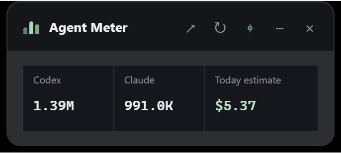
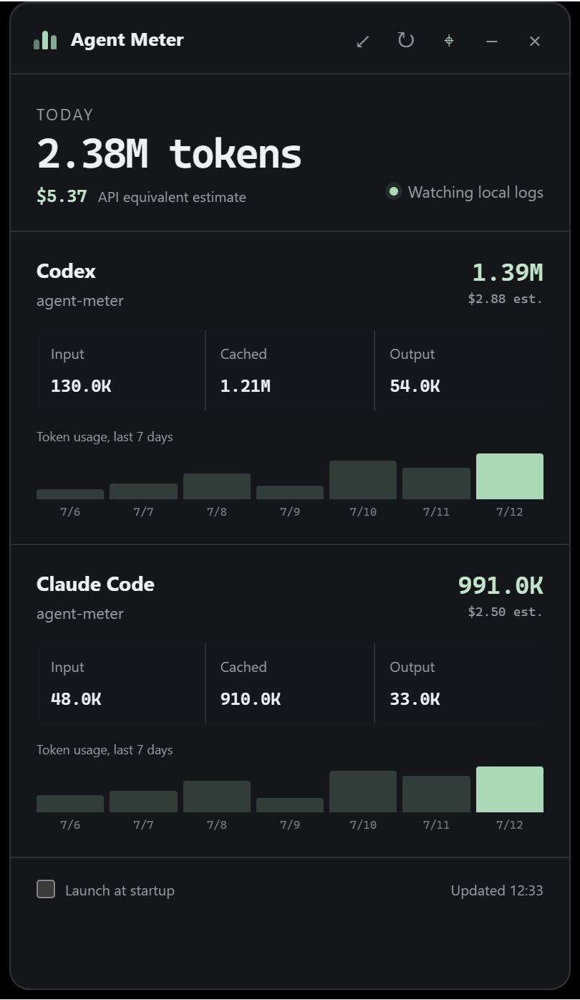
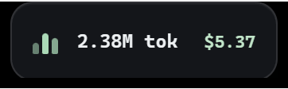

<div align="center">

# Agent Meter

**A lightweight Windows and macOS widget for Codex and Claude Code usage.**

[](https://github.com/wjh19990923/agent-meter/releases/tag/v0.6.0)

<a href="#english"></a>
<a href="#中文"></a>

[](https://github.com/wjh19990923/agent-meter/releases/download/v0.6.0/Agent-Meter-Tauri-0.6.0-Portable.exe)
[](https://github.com/wjh19990923/agent-meter/releases/download/v0.6.0/Agent-Meter-Tauri-0.6.0-Setup.exe)
[](https://github.com/wjh19990923/agent-meter/releases/download/v0.6.0/Agent-Meter-0.6.0-macOS-Universal.dmg)

## Two views, one click / 一键切换两种形态

<table>
  <tr>
    <th>Compact widget / 紧凑小浮窗</th>
    <th>Expanded details / 展开详情</th>
  </tr>
  <tr>
    <td align="center" valign="top">
      
      <br>
      <sub>Codex + Claude + today's estimate / 一眼查看双端用量与费用</sub>
    </td>
    <td align="center" valign="top">
      
      <br>
      <sub>Breakdowns, costs, projects, and charts / 明细、费用、项目与趋势</sub>
    </td>
  </tr>
</table>

### Edge-docked micro widget / 贴边微型浮窗



Drag the widget against any screen edge to shrink it automatically; drag it away to restore the compact view. / 将浮窗拖到屏幕任意边缘会自动缩小，拖离边缘即可恢复。

</div>

---

## English

Agent Meter is a lightweight, local-first Windows and macOS desktop widget for monitoring Codex and Claude Code token usage and API-equivalent cost estimates. It is built with Tauri 2.

**Current release: [v0.6.0](https://github.com/wjh19990923/agent-meter/releases/tag/v0.6.0)**

### Download

| Package | Best for | Direct download |
|---|---|---|
| Windows portable `.exe` | Trying Agent Meter without installing it | [Download Windows portable](https://github.com/wjh19990923/agent-meter/releases/download/v0.6.0/Agent-Meter-Tauri-0.6.0-Portable.exe) |
| Windows NSIS installer | Daily use and Start Menu integration | [Download Windows installer](https://github.com/wjh19990923/agent-meter/releases/download/v0.6.0/Agent-Meter-Tauri-0.6.0-Setup.exe) |
| macOS universal `.dmg` | Apple Silicon and Intel Macs | [Download macOS DMG](https://github.com/wjh19990923/agent-meter/releases/download/v0.6.0/Agent-Meter-0.6.0-macOS-Universal.dmg) |

Windows SmartScreen or macOS Gatekeeper may warn because the binaries are not notarized with paid platform certificates. On macOS, open the DMG, drag Agent Meter to Applications, then Control-click the app and choose **Open** the first time.

### How it works

Agent Meter reads token metadata from local session files:

- Windows: `%USERPROFILE%\.codex\sessions\**\*.jsonl` and `%USERPROFILE%\.claude\projects\**\*.jsonl`
- macOS: `~/.codex/sessions/**/*.jsonl` and `~/.claude/projects/**/*.jsonl`

No API key or account login is required. Session files are read in place and are never modified or uploaded.

### Compact widget

The default compact view stays out of the way and shows three values at a glance:

- today's Codex tokens;
- today's Claude Code tokens;
- today's estimated API-equivalent cost.

Use the controls in the title bar to expand, refresh, keep the widget on top, hide it, or close it to the system tray.

### Edge docking

Drag the widget until it touches the top, bottom, left, or right edge of the current monitor. It snaps into place and shrinks to a `168 × 48` logical-pixel micro widget showing combined tokens and today's estimated cost. Drag the micro widget away from the edge to restore the normal compact view. The usable work area is respected, so it does not cover the taskbar.

### Expanded details

Click the diagonal arrow in the title bar to open the detailed view.


The expanded view adds:

- total tokens and estimated USD cost for today;
- separate Codex and Claude Code totals;
- input, cached-input, and output token breakdowns;
- per-source API-equivalent cost estimates;
- seven-day activity charts with explicit calendar dates;
- current project name, refresh state, and launch-at-startup control.

Click the diagonal arrow again to return to the compact widget.

### Optional cckey / OAT status

If Agent Meter detects the local `~/.claude-oat-switch/keys.sh` configuration, the expanded view adds an OAT key panel. It shows which key is active, whether each configured key can currently reach Anthropic, remaining 5-hour and 7-day quota percentages when provided by the response, and the model used by the latest Claude Code session.

The feature is capability-detected and stays hidden for everyone else. Tokens never reach the webview, logs, screenshots, or Agent Meter cache. Quota probes are made directly to Anthropic and cached for five minutes; **Check now** performs one 1-token probe per configured key.

### Cost estimates

Costs are calculated locally from a bundled snapshot of the [LiteLLM model pricing database](https://github.com/BerriAI/litellm/blob/main/model_prices_and_context_window.json), the same upstream pricing source used by ccusage. Input, cache read, cache write, and output prices are calculated separately when the model provides them.

These values are **API-equivalent estimates**. They are not ChatGPT Pro, Claude Pro, or Claude Max subscription bills. Provider prices and local log formats can change.

### Build from source

Prerequisites:

- Windows 10/11 with WebView2, or macOS;
- Rust stable using the MSVC toolchain;
- Microsoft C++ Build Tools;
- Node.js.

```powershell
git clone https://github.com/wjh19990923/agent-meter.git
cd agent-meter
npm.cmd install
npm.cmd run dev
```

Run checks and create a release build:

```powershell
npm.cmd run check
npm.cmd run build
```

On macOS, use `npm install`, `npm run dev`, and `npm run build:macos`. A tagged release is built as a universal DMG on a native macOS GitHub runner.

---

## 中文

Agent Meter 是一个轻量、完全本地运行的 Windows 和 macOS 桌面小组件，用来查看 Codex 和 Claude Code 的 token 用量以及 API 等价费用估算。项目使用 Tauri 2 构建。

**当前版本：[v0.6.0](https://github.com/wjh19990923/agent-meter/releases/tag/v0.6.0)**

### 下载

| 版本 | 适合场景 | 直接下载 |
|---|---|---|
| Windows 便携版 `.exe` | 不安装，下载后直接测试 | [下载 Windows 便携版](https://github.com/wjh19990923/agent-meter/releases/download/v0.6.0/Agent-Meter-Tauri-0.6.0-Portable.exe) |
| Windows NSIS 安装包 | 长期使用，集成到开始菜单 | [下载 Windows 安装包](https://github.com/wjh19990923/agent-meter/releases/download/v0.6.0/Agent-Meter-Tauri-0.6.0-Setup.exe) |
| macOS 通用 `.dmg` | 同时支持 Apple Silicon 和 Intel Mac | [下载 macOS DMG](https://github.com/wjh19990923/agent-meter/releases/download/v0.6.0/Agent-Meter-0.6.0-macOS-Universal.dmg) |

由于当前文件没有付费平台签名与 Apple 公证，Windows SmartScreen 或 macOS Gatekeeper 可能会提示。macOS 首次使用时，把应用拖入“应用程序”，然后按住 Control 点击 Agent Meter 并选择 **打开**。

### 工作原理

Agent Meter 读取本机的 token 元数据：

- Windows：`%USERPROFILE%\.codex\sessions\**\*.jsonl` 和 `%USERPROFILE%\.claude\projects\**\*.jsonl`
- macOS：`~/.codex/sessions/**/*.jsonl` 和 `~/.claude/projects/**/*.jsonl`

软件不需要 API Key，也不需要登录账号。它只读本地 session 文件，不修改文件，也不会上传聊天记录或使用数据。

### 紧凑浮窗

软件启动后默认显示为紧凑小浮窗，一眼可以看到：

- 今天 Codex 使用的 token；
- 今天 Claude Code 使用的 token；
- 今天的 API 等价费用估算。

标题栏按钮可以展开详情、手动刷新、保持置顶、隐藏窗口，或者关闭到系统托盘。

### 贴边吸附

把浮窗拖到当前显示器的顶部、底部、左侧或右侧，它会自动贴边并缩成 `168 × 48` 逻辑像素的微型组件，只保留总 token 和今日预估费用。把微型组件拖离边缘后，会自动恢复普通紧凑浮窗。吸附位置会避开任务栏，并支持多显示器的各自工作区域。

### 展开详情

点击标题栏中的斜向箭头，即可展开完整信息。


展开后可以看到：

- 今天的总 token 和预计美元成本；
- Codex 与 Claude Code 各自的 token 和费用；
- Input、Cached Input 与 Output token 明细；
- 每个来源的 API 等价费用估算；
- 带明确日期横轴的最近 7 天用量图；
- 当前项目名称、刷新状态和开机启动选项。

再次点击斜向箭头即可收回紧凑浮窗。

### 可选的 cckey / OAT 状态

如果 Agent Meter 检测到本机的 `~/.claude-oat-switch/keys.sh` 配置，展开模式会自动增加 OAT Key 状态面板，显示当前激活 Key、每把 Key 是否可用、服务端返回的 5 小时与 7 天剩余百分比，以及最近一次 Claude Code session 实际使用的模型。

没有安装或配置 `cckey` 的用户不会看到这块面板，窗口仍保持原来的展开高度。OAT 不会进入前端、日志、截图或 Agent Meter 缓存；配额结果缓存 5 分钟，点击 **Check now** 会为每把已配置 Key 发送一次 1-token 探测请求。

### 关于费用

费用根据内置的 [LiteLLM 模型价格数据库](https://github.com/BerriAI/litellm/blob/main/model_prices_and_context_window.json)快照在本地计算，ccusage 也使用同一上游价格来源。对于支持的模型，普通输入、缓存读取、缓存写入和输出会分别计价。

这里显示的是 **API 等价费用估算**，不是 ChatGPT Pro、Claude Pro 或 Claude Max 的真实订阅账单。模型价格和本地日志格式未来都可能发生变化。

### 从源码运行

开发环境需要：

- 带 WebView2 的 Windows 10/11，或 macOS；
- 使用 MSVC 工具链的 Rust stable；
- Microsoft C++ Build Tools；
- Node.js。

```powershell
git clone https://github.com/wjh19990923/agent-meter.git
cd agent-meter
npm.cmd install
npm.cmd run dev
```

运行检查并构建 Windows 安装包：

```powershell
npm.cmd run check
npm.cmd run build
```

在 macOS 上使用 `npm install`、`npm run dev` 和 `npm run build:macos`。推送版本标签后，GitHub Actions 会在原生 macOS 环境构建同时支持 Apple Silicon 与 Intel 的通用 DMG。

---

## Privacy and license / 隐私与许可证

Agent Meter processes usage metadata locally. See [SECURITY.md](SECURITY.md) for the security policy and [THIRD_PARTY_NOTICES.md](THIRD_PARTY_NOTICES.md) for pricing-data attribution.

Agent Meter 在本地处理用量元数据。安全策略见 [SECURITY.md](SECURITY.md)，价格数据来源见 [THIRD_PARTY_NOTICES.md](THIRD_PARTY_NOTICES.md)。

Released under the [MIT License](LICENSE).
